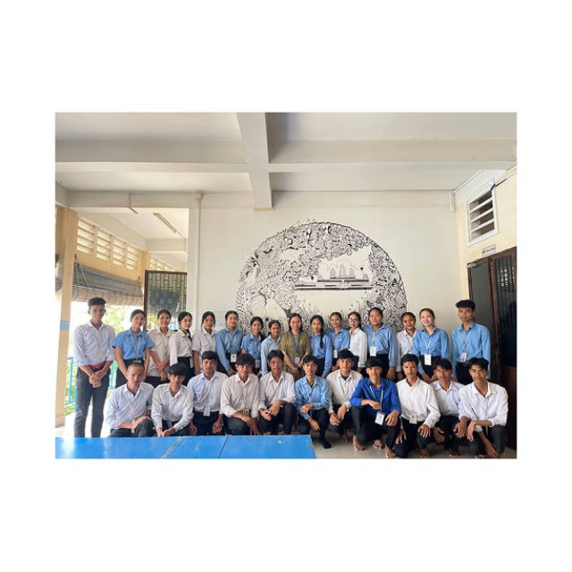

# 🏫 PNC School #

[](https://www.passerellesnumeriques.org/what-we-do/cambodia/)

I'm a student 2026 at Passerelles Numériques Cambodia (PNC). Located on St. 371 Phum Tropeang Chhuk (Borey Sorla) Sangkat, Tek Thla Khan Sen Sok, Phnom Penh CAMBODIA.

---

## 📚 Table of Contents ##

- [Bootstrap]()
- [Facebook]()
- [Youtube]()
- [w3scools]()
- [Python]()
- [Github]()

---

## ✨ Features ##
- Completed studies at​​ PNC
- Pass exam
- Professional Web developer
- Have a good job
- Have good salary
- Help family

---

## 🛠 Tech Stack ##
- **Programming Language:** JavaScript(Node.js)
- **Runtime:** Node.js
- **Framework** Express.js, AngularJs, Next.js
- **Database:** MongoDB / Mongoose (or MySQL / Sequelize)
- **Authentication:** JSON Web Token (JWT)
- **Environment Management:** dotenv
- **Testing:** Jest / Mocha (optional)

[]()
[]()
[]()
[]()

---

## 🚀 Installation ##
Clone the project and install dependencies:

```
git clone https://github.com/your-username/school-management-system.git
```
```
cd school-management-system
```
```
npm install
```
